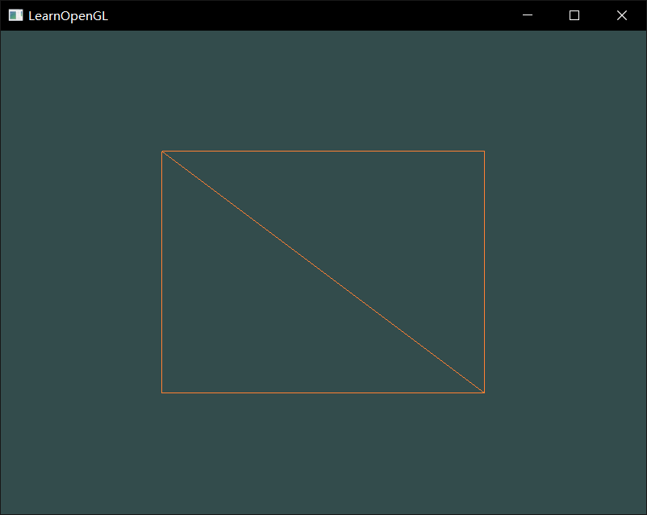

# LearnOpenGL
LearnOpenGL

[环境搭建](https://www.cnblogs.com/kirito1/p/12219083.html)

## 程序展示
* HelloWindow

* HelloTriangle

* HelloTriangle_2

* Shaders_uniform

* Shaders_2

* Textures

* Textures_mix

* Transformation

