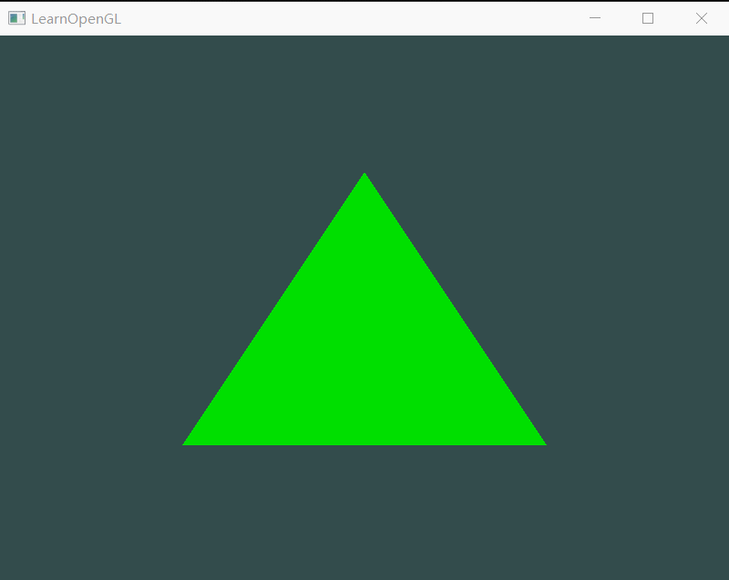
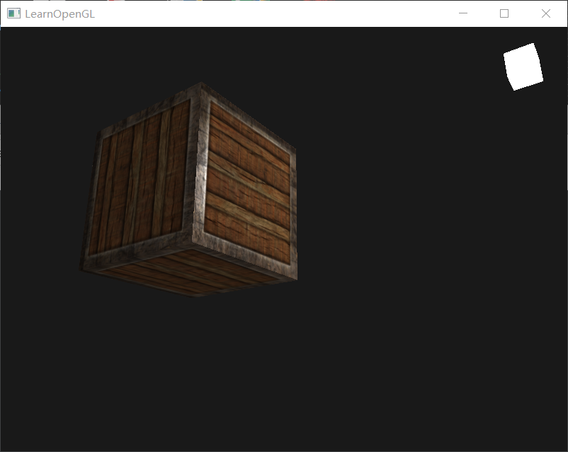

# LearnOpenGL
LearnOpenGL

[环境搭建](https://www.cnblogs.com/kirito1/p/12219083.html)

## 程序展示

### 入门(start)
<table>
    <tr>
        <td align="center"> HelloWindow
        <td align="center"> HelloTriangle
    </tr>
    <tr>
        <td align="center"> HelloTriangle_2
        <td align="center"> Shaders_uniform
    </tr>
    <tr>
        <td align="center"> Shaders_2
        <td align="center"> Textures
    </tr>
    <tr>
        <td align="center"> Textures_mix
        <td align="center"> Transformation
    </tr>
    <tr>
        <td align="center"> Start3d
        <td align="center"> More3d
    </tr>
    <tr>
        <td align="center"> More3d_2
        <td align="center"> Camera
    </tr>
    <tr>
        <td align="center"> Camera_move
    </tr>
</table>

### 光照(lighting)
<table>
    <tr>
        <td align="center"> Color
        <td align="center"> Basic_lighting
    </tr>
    <tr>
        <td align="center"> Materials
        <td align="center"> Lighting_maps
    </tr>
</table>
