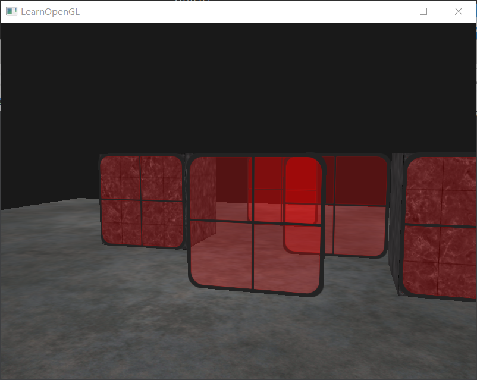

# LearnOpenGL
LearnOpenGL

[环境搭建](https://www.cnblogs.com/kirito1/p/12219083.html)

## 程序展示

### 入门(start)
<table>
    <tr>
        <td align="center"> HelloWindow
        <td align="center"> HelloTriangle
    </tr>
    <tr>
        <td align="center"> HelloTriangle_2
        <td align="center"> Shaders_uniform
    </tr>
    <tr>
        <td align="center"> Shaders_2
        <td align="center"> Textures
    </tr>
    <tr>
        <td align="center"> Textures_mix
        <td align="center"> Transformation
    </tr>
    <tr>
        <td align="center"> Start3d
        <td align="center"> More3d
    </tr>
    <tr>
        <td align="center"> More3d_2
        <td align="center"> Camera
    </tr>
    <tr>
        <td align="center"> Camera_move
    </tr>
</table>

### 光照(lighting)
<table>
    <tr>
        <td align="center"> Color
        <td align="center"> Basic_lighting
    </tr>
    <tr>
        <td align="center"> Materials
        <td align="center"> Lighting_maps
    </tr>
    <tr>
        <td align="center"> Directional 平行光
        <td align="center"> Point 点光源
    </tr>
    <tr>
        <td align="center"> Spot 聚光
        <td align="center"> Spot_soft 边缘软化
    </tr>
    <tr>
        <td align="center"> Multiple_lights 多光源
    </tr>
</table>

### 模型(model)
<table>
    <tr>
        <td align="center"> Model_loading 模型加载
        <td align="center"> Model_girl
    </tr>

</table>

### 高级(advance)
<table>
    <tr>
        <td align="center"> Depth_testing 深度测试
        <td align="center"> Stencil_testing 模板测试_轮廓线
    </tr>
    <tr>
        <td align="center"> Blending_discard 混合 丢弃透明片段
        <td align="center"> Blending_translucent 混合 半透明片段
    </tr>
    <tr>
        <td align="center"> FaceCulling 面剔除 
        <td align="center"> Framebuffers 帧缓冲_渲染到纹理 
    </tr>
    <tr>
        <td align="center"> Framebuffers_post_processing 帧缓冲_后期处理 
    </tr>

</table>